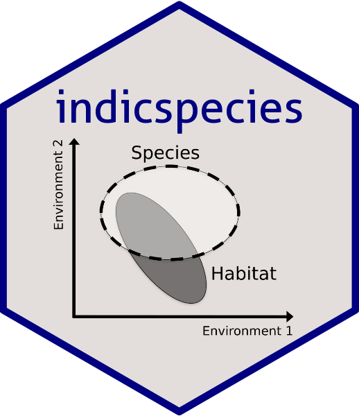

# Relationship between species and groups of sites <a href="https://emf-creaf.github.io/indicspecies/"></a>

<!-- badges: start -->

[](https://cran.r-project.org/package=indicspecies)
[](https://cran.rstudio.com/web/packages/indicspecies/index.html)
[](https://github.com/emf-creaf/indicspecies/actions/workflows/R-CMD-check.yaml)
<!-- badges: end -->

## Introduction

Package `indicspecies` provides functions to conduct:

- **Indicator species analysis**: Assess the strength and statistical
  significance of the relationship between species occurrence/abundance
  and groups of sites (De Cáceres & Legendre 2009; De Cáceres et
  al. 2010; De Cáceres et al. 2012).

- **Species niche analysis**: Measure species niche metrics using
  resource categories (De Cáceres et al. 2011).

## Package installation

Package`indicspecies` can be found at
[CRAN](https://cran.r-project.org/) package repository. In addition, the
latest stable `indicspecies` R package can be installed from GitHub as
follows:

``` r
remotes::install_github("emf-creaf/indicspecies")
```

Additionally, users can have help to run package functions directly as
package vignettes, by forcing their inclusion in installation:

``` r
remotes::install_github("emf-creaf/indicspecies", 
                        build_opts = c("--no-resave-data", "--no-manual"),
                        build_vignettes = TRUE)
```

## Usage

Use `strassoc()` for assessing strength of associations and
`signassoc()` to assess the statistical significance of the associations
(De Cáceres & Legendre 2009). Much more complete functions are
`multipatt()` (De Cáceres et al. 2010) and `indicators()` (De Cáceres et
al. 2012).

## Maintenance

Although not in active development, the R package is maintained by the
[*Ecosystem Modelling Facility*](https://emf.creaf.cat) unit at CREAF
(in Spain).

## References

- De Cáceres, M., & Legendre, P. (2009). Associations between species
  and groups of sites: indices and statistical inference. Ecology,
  90(12), 3566–3574 (<https://doi.org/10.1890/08-1823.1>).

- De Cáceres, M., Legendre, P., & Moretti, M. (2010). Improving
  indicator species analysis by combining groups of sites. Oikos,
  119(10), 1674–1684
  (<https://doi.org/10.1111/j.1600-0706.2010.18334.x>).

- De Cáceres, M., Legendre, P., Wiser, S. K., & Brotons, L. (2012).
  Using species combinations in indicator value analyses. Methods in
  Ecology and Evolution, 3, 973–982
  (<https://doi.org/10.1111/j.2041-210X.2012.00246.x>).

- De Cáceres, M., Sol, D., Lapiedra, O., & Legendre, P. (2011). A
  framework for estimating niche metrics using the resemblance between
  qualitative resources. Oikos, 120(February), 1341–1350
  (<https://doi.org/10.1111/J.1600-0706.2011.19679.x>).
